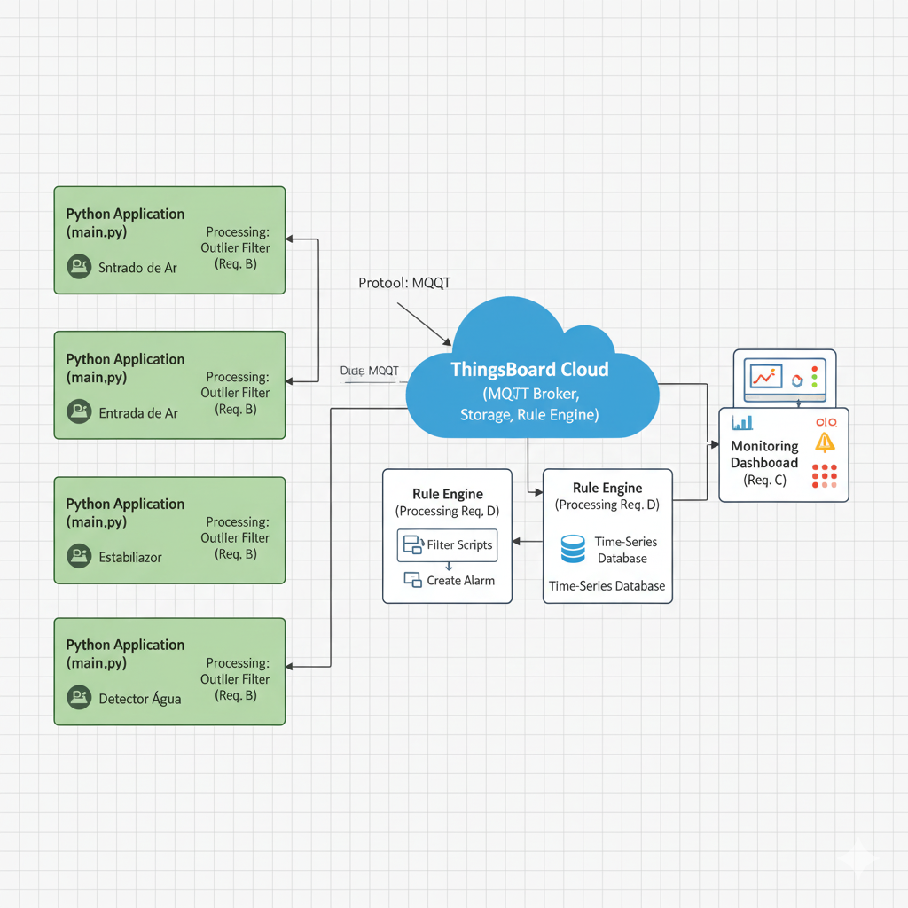

# 💻 README: Monitoramento de Sala de Servidores com IoT Distribuída (ThingsBoard)

Este projeto implementa um ambiente de **Internet das Coisas (IoT) distribuída** simulando o monitoramento crítico de uma Sala de Servidores (Data Center). O sistema envia dados de sensoriamento, aplica processamento local de *outliers* e gera **Alarmes Críticos** na plataforma em nuvem **ThingsBoard**.

## Requisitos e Funcionalidades

| Requisito | Funcionalidade | Implementação no Projeto |
| :--- | :--- | :--- |
| **A) 4 Dispositivos** | Simulação de sensores em diferentes locais. | **4 Clientes MQTT em Threads Separadas.** |
| **B) Processamento Local** | Tratamento de dados brutos do sensor. | Algoritmo de **Eliminação de Outliers** no código Python. |
| **C) Nuvem (Armazenamento e Dashboard)** | Recebimento, armazenamento e visualização de dados. | **ThingsBoard Cloud** para armazenamento e **Dashboards** em tempo real. |
| **D) Processamento Nuvem** | Lógica de alerta baseada em gatilhos. | **Cadeia de Regras** no ThingsBoard gera **Alarmes Críticos**. |

---

## Arquitetura de Componentes

O sistema segue uma arquitetura distribuída, utilizando o protocolo MQTT para comunicação assíncrona.

### Diagrama da Arquitetura

O diagrama ilustra o fluxo de dados dos 4 dispositivos independentes para a plataforma em nuvem:



1.  **Dispositivos (4 Clientes Python):** Simulam sensores em diferentes pontos (Temperatura, Umidade, Vibração e Vazamento).
2.  **Protocolo MQTT:** Usado para envio leve e eficiente de telemetria.
3.  **ThingsBoard Cloud:** Atua como Broker MQTT, Servidor de Armazenamento e Motor de Regras.

### Arquitetura de Threads

O arquivo `main.py` utiliza o módulo `threading` do Python para garantir que os 4 dispositivos funcionem de forma **independente e simultânea**.

* **Classe `SensorDevice`:** Cada um dos 4 sensores é uma instância desta classe e roda em sua própria **Thread independente**.
* **Independência:** Cada Thread possui seu próprio cliente MQTT e **Access Token** único, provando que são dispositivos distintos.
* **Encerramento Limpo:** É utilizado um **`threading.Event()` (`stop_event`)** para capturar o comando `Ctrl+C` e garantir que todas as 4 threads sejam encerradas e desconectadas do broker de forma segura.

---

## Sensores e Padrões de Alerta

O monitoramento se concentra em vetores de risco críticos para um Data Center.

| Dispositivo | Variável (`data_key`) | Unidade | Padrão de Outlier (Local) | Gatilho de Alerta (Nuvem) |
| :--- | :--- | :--- | :--- | :--- |
| **Servidor Principal** | `temp_rack` | $\mathbf{^\circ C}$ | $< 10^\circ C$ ou $> 50^\circ C$ | **Alarme** se $\mathbf{\ge 30^\circ C}$ |
| **Entrada de Ar** | `umidade_ar` | $\mathbf{\%}$ | $< 20\%$ ou $> 90\%$ | *Não gera alarme crítico* (Monitoramento) |
| **Estabilizador** | `vibracao_fan` | Unit / $\mathbf{g}$ | $< 5$ ou $> 1500$ |  *Não gera alarme crítico* (Monitoramento)|
| **DetectorAgua** | `vazamento_agua` | Binário $\mathbf{0/1}$ | Valor diferente de 0 ou 1 | **Alarme CRÍTICO** se $\mathbf{= 1}$ |

---

## Instruções de Uso

### Pré-requisitos

1.  Python 3.x instalado.
2.  Instale a biblioteca `paho-mqtt`:
    ```bash
    pip install paho-mqtt
    ```
3.  Caso deseje executar em sua ferramenta, crie **4 Dispositivos** no ThingsBoard e obtenha os 4 **Access Tokens**.

### Execução da Simulação

1.  Substitua os tokens no bloco `devices` do `main.py` pelos seus tokens.
2.  Execute o script:
    ```bash
    python main.py
    ```
3.  Para parar de forma segura, pressione **Ctrl+C**.